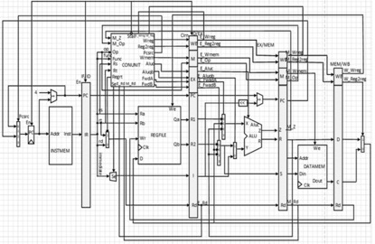
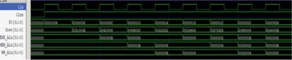

# 流水线CPU verilog实现

## 成果

1. **完成了流水线处理器的设计和实现，支持add、sub、and、or、addi、andi、ori、lw、sw、beq、bne和j十二条指令**
2. **支持数据前推，提前半个周期下降沿写入**
3. **支持lw指令的数据冒险。**

## 实现指令

| R型指令 |         |         |         |           |            |        |          |
| ------- | ------- | ------- | ------- | --------- | ---------- | ------ | -------- |
| 指令    | [31:26] | [25:21] | [20:16] | [15:11]   | [10:6]     | [5:0]  | 功能     |
| add     | 000000  | rs      | rt      | rd        | 00000      | 100000 | 寄存器加 |
| sub     | 000000  | rs      | rt      | rd        | 00000      | 100010 | 寄存器减 |
| and     | 000000  | rs      | rt      | rd        | 00000      | 100100 | 寄存器与 |
| or      | 000000  | rs      | rt      | rd        | 00000      | 100101 | 寄存器或 |
| I型指令 |         |         |         |           |            |        |          |
| addi    | 001000  | rs      | rt      | immediate | 立即数加   |        |          |
| andi    | 001100  | rs      | rt      | immediate | 立即数与   |        |          |
| xori    | 001110  | rs      | rt      | immediate | 立即数异或 |        |          |
| lw      | 100011  | rs      | rt      | immediate | 取数       |        |          |
| sw      | 101011  | rs      | rt      | immediate | 存数       |        |          |
| beq     | 000100  | rs      | rt      | immediate | 相等转移   |        |          |
| bne     | 000101  | rs      | rt      | immediate | 不等转移   |        |          |
| J型指令 |         |         |         |           |            |        |          |
| j       | 000010  | address | 跳转    |           |            |        |          |

## CPU结构图

# 

## 仿真结果

第三条指令 0x00435020 是对寄存器 2 和寄存器 3 的数相加

放回寄存器 10 中，而第二条指令是对立即数进行相加的指 令，会产生数据冲突在图中可以看见 ID 级中的 Fwda 值为 01，选取了 EXE_Alu 进行了前推，最后结果为 6，与预测的 相同，因此完成了数据冒险

在图中可以看见，因为 0x10220002 是 beq 指令，前面的 0x8c80002 是 lw 取数指令，因此这里存在着数据冒险和控制 冒险，因为 lw 指令在 WB 级才能得到结果，所以 beq 指令只 能停一个周期

